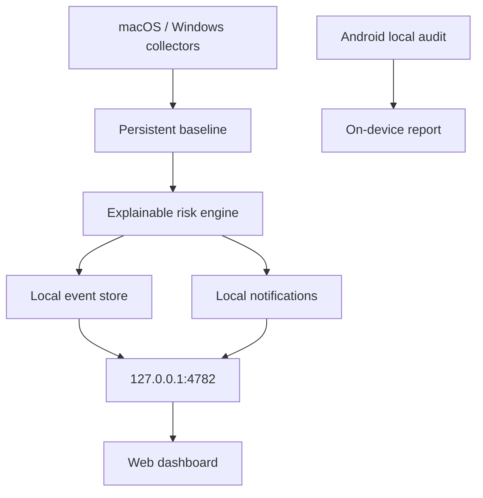

# Tashev Guard

[](LICENSE)


**Open-source, local-first security monitor for your own devices.**

Tashev Guard helps you understand who and what can connect to your computer, which processes are listening for inbound connections, what changed in persistence/autostart, and whether common remote-access tools are active.

> **Preview:** Tashev Guard is a security visibility tool, not an antivirus and not a malware verdict engine.

[Русская версия](README.ru.md)

## Why Tashev Guard?

Most people should not need to understand PID tables, TCP states, LaunchAgents, WinRM, VNC or SSH just to answer a simple question:

> **“Is anyone connected to my computer right now?”**

Tashev Guard turns low-level system signals into an explainable local dashboard.

## Current status

| Platform | Status | What works |
| --- | --- | --- |
| macOS | ✅ Tested | connections, listeners, remote sessions/tools, LaunchAgents/Daemons, baseline, notifications |
| Windows | 🟡 Preview | TCP/listeners, sessions, remote tools, startup inventory; runtime verification still needed |
| Android | 🧪 Experimental | local device security audit, VPN/network state, DNS, proxy, ADB, Accessibility, remote-app indicators |
| iOS | 📌 Planned | capability-limited companion; no unrestricted process inspection |

## Features

- Active TCP connections with process and PID
- Listening ports and the process accepting connections
- Remote-session indicators
- Detection hints for AnyDesk, TeamViewer, RustDesk, VNC, SSH, Screen Sharing and similar tools
- Code-signing information for detected remote-control processes where available
- macOS LaunchAgents / LaunchDaemons inventory
- Windows startup inventory
- Persistent local baseline of normal listeners and autoruns
- Alerts for newly observed listeners and persistence entries
- Local event history
- Local desktop notifications
- Reverse DNS without uploading your complete connection list to a third-party reputation service
- CLI audit mode
- Responsive local web dashboard bound to `127.0.0.1`

## Quick start

Requires **Node.js 20+**.

```bash
git clone https://github.com/tashev11/tashev-guard.git
cd tashev-guard
npm start
```

Open:

```text
http://127.0.0.1:4782
```

One-shot audit without the dashboard:

```bash
npm run scan
```

### Start automatically on macOS

```bash
npm run autostart:mac
```

### Start automatically on Windows

```powershell
npm run autostart:win
```

## Android companion

The Android module is intentionally **read-only** for now. It checks:

- VPN / active transport
- DNS, Private DNS and HTTP proxy
- total RX/TX counters
- secure screen lock
- Developer Options and ADB
- Device Admin where Android permits the query
- enabled Accessibility services
- notification-listener indicators
- selected remote-access apps
- a basic test-keys heuristic

Build it with:

```bash
cd android
./gradlew --no-daemon assembleDebug lintDebug
```

Current configuration: **minSdk 26, targetSdk 36, compileSdk 36, JDK 17**.

A full `VpnService` packet monitor is deliberately not enabled until a tested TCP/UDP forwarding path is implemented. Tashev Guard will not ship a fake VPN that can black-hole a phone's traffic.

## Architecture



## Security model

Tashev Guard is designed around **local-first, least-privilege visibility**:

- the desktop dashboard binds to `127.0.0.1` only;
- no cloud account is required;
- there is no telemetry in the current preview;
- the desktop API is read-only except for explicit local baseline reset;
- processes are not killed automatically;
- firewall rules are not changed automatically;
- security findings are indicators with evidence, not claims that a device is compromised.

Read the full [Security Model](docs/SECURITY-MODEL.md) and [Privacy Notes](docs/PRIVACY.md).

## Baseline

On first run, Tashev Guard records the current listening ports and persistence entries as the local baseline. Later changes are highlighted separately.

Only relearn the baseline when you trust the current state of the device.

## Verification

Desktop:

```bash
npm test
npm run scan
```

Android:

```bash
cd android
./gradlew --no-daemon assembleDebug lintDebug
```

At the time of the first public preview:

- desktop unit tests: **6/6 passing**
- Android `assembleDebug`: **BUILD SUCCESSFUL**
- Android Lint: **0 issues**
- macOS collector: runtime-tested
- Windows collector: implemented, runtime verification pending
- Android physical-device smoke test: pending

## Roadmap

See [ROADMAP.md](ROADMAP.md).

Short version:

1. Windows runtime verification
2. Signed desktop builds
3. Safe manual investigation/block actions with undo
4. Android on-device runtime testing
5. Android `VpnService` monitoring with real TCP/UDP forwarding
6. Secure pairing of a user's own devices
7. Optional multi-device dashboard

## Contributing

Contributions are welcome. Please read [CONTRIBUTING.md](CONTRIBUTING.md) before opening a pull request.

For security vulnerabilities, **do not open a public issue**. See [SECURITY.md](SECURITY.md).

## License

The software is licensed under **GNU GPL v3.0 only**. See [LICENSE](LICENSE).

The GPL does not grant rights to use the **Tashev Guard** project name or logo to imply endorsement. See [TRADEMARKS.md](TRADEMARKS.md).
