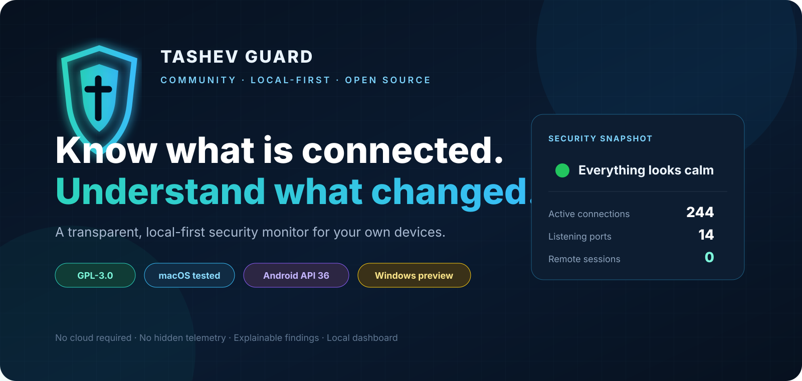
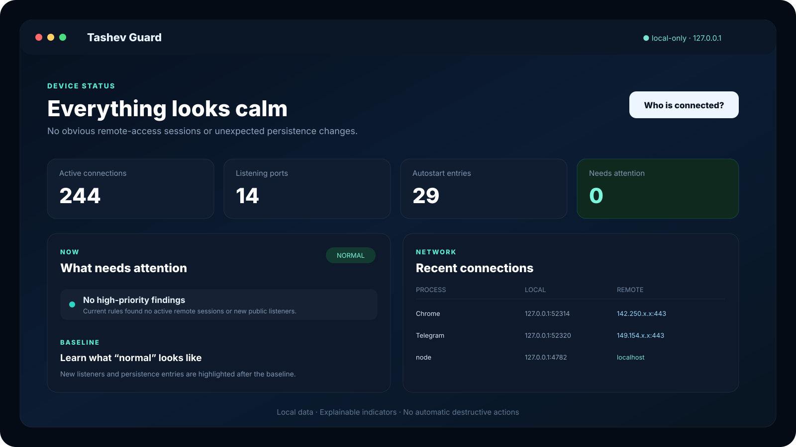
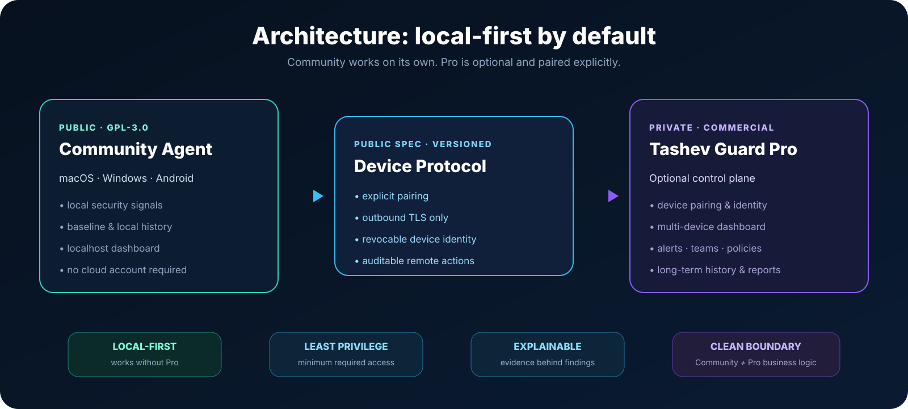

<p align="center">
  
</p>

<p align="center">
  <a href="https://github.com/tashev11/tashev-guard/releases"></a>
  <a href="LICENSE"></a>
  <a href="SECURITY.md"></a>
  <a href="https://github.com/tashev11/tashev-guard/issues"></a>
</p>

<p align="center">
  <strong>Open-source. Local-first. Explainable.</strong><br>
  See active connections, listening ports, remote-access indicators, persistence changes, and local security signals without sending your device telemetry to a cloud service.
</p>

<p align="center">
  <a href="#quick-start"><strong>Quick start</strong></a> ·
  <a href="#what-it-does"><strong>Features</strong></a> ·
  <a href="#architecture"><strong>Architecture</strong></a> ·
  <a href="docs/SECURITY-MODEL.md"><strong>Security model</strong></a> ·
  <a href="ROADMAP.md"><strong>Roadmap</strong></a> ·
  <a href="README.ru.md">Русский</a>
</p>

---

## One question, without the low-level noise

> **“Is anyone connected to my computer — and what changed since I last checked?”**

Operating systems expose the answer through process tables, TCP states, listening sockets, startup entries, code signatures, user sessions, and other low-level signals.

**Tashev Guard turns those signals into one local, explainable view.**

<p align="center">
  
</p>

> [!IMPORTANT]
> **Tashev Guard is a security visibility tool, not an antivirus verdict engine.**
> A listening port, remote-control application, or unusual process can be legitimate. Findings are shown with evidence so the device owner can verify them.

---

## What it does

<table>
<tr>
<td width="50%" valign="top">

### 🔌 Network visibility

- Active TCP connections
- Process name and PID
- Local and remote endpoints
- Listening ports
- Reverse DNS where available
- Public vs local-only listener context

</td>
<td width="50%" valign="top">

### 🖥 Remote-access visibility

- Remote user-session indicators
- AnyDesk / TeamViewer / RustDesk hints
- VNC / SSH / Screen Sharing indicators
- Code-signing information where available
- Remote-access port detection
- Explainable severity instead of malware claims

</td>
</tr>
<tr>
<td width="50%" valign="top">

### 🧭 Change detection

- Persistent local baseline
- New listening ports
- New persistence / autostart entries
- macOS LaunchAgents / LaunchDaemons
- Windows startup inventory
- Local event history

</td>
<td width="50%" valign="top">

### 🔒 Local-first by design

- Dashboard bound to `127.0.0.1`
- No cloud account required
- No hidden telemetry in the preview
- No automatic process killing
- No automatic firewall changes
- Local notifications for important new events

</td>
</tr>
</table>

---

## Platform status

| Platform | Status | Current coverage |
|---|---|---|
| **macOS** | ✅ **Runtime tested** | connections, listeners, remote sessions/tools, signatures, LaunchAgents/Daemons, baseline, local notifications |
| **Windows** | 🟡 **Preview** | TCP/listeners, sessions, remote tools, startup inventory — real Windows runtime verification still pending |
| **Android** | 🧪 **Experimental** | local device audit, VPN/network state, DNS, proxy, ADB, Accessibility, remote-app indicators |
| **iOS** | 📌 **Planned** | capability-limited companion; no claims of unrestricted process/socket inspection |

### Verified in the current preview

- ✅ Desktop unit tests: **6/6 passing**
- ✅ Android `assembleDebug`: **BUILD SUCCESSFUL**
- ✅ Android Lint: **0 issues**
- ✅ macOS collector: **runtime tested**
- ⏳ Windows collector: **runtime verification pending**
- ⏳ Android physical-device smoke test: **pending**

---

## Quick start

### 1. Clone

```bash
git clone https://github.com/tashev11/tashev-guard.git
cd tashev-guard
```

### 2. Start the local dashboard

Requires **Node.js 20+**.

```bash
npm start
```

Open:

```text
http://127.0.0.1:4782
```

### 3. Or run a one-shot audit

```bash
npm run scan
```

### Optional autostart

**macOS**

```bash
npm run autostart:mac
```

**Windows**

```powershell
npm run autostart:win
```

> [!TIP]
> Start with local mode. Learn what your normal device state looks like before enabling any future remote or automated response capability.

---

## Baseline: what changed?

The first trusted state becomes a **local baseline** for:

- listening ports;
- persistence / autostart entries.

Later changes are highlighted separately instead of treating every active connection as suspicious.

This reduces noise and makes the dashboard answer a more useful question:

> **“What is new compared with the state I already trust?”**

Only relearn the baseline when you are confident the current device state is normal.

---

## Architecture

<p align="center">
  
</p>

The public Community edition is useful **without any cloud service**.

Optional commercial services are intentionally separated behind a documented, versioned protocol boundary:

- Community remains local-first;
- pairing must be explicit;
- device connections are outbound by default;
- no inbound internet port is required on the user's device;
- remote actions must be authenticated and auditable;
- Community sends nothing to Pro until the user pairs the device.

Read:

- [Security Model](docs/SECURITY-MODEL.md)
- [Privacy Notes](docs/PRIVACY.md)
- [Community / Pro Boundary](docs/COMMUNITY-PRO-BOUNDARY.md)
- [Device Protocol Draft](docs/PROTOCOL.md)
- [Community & Commercial Editions](COMMERCIAL.md)

---

## Android companion

The Android module is intentionally **read-only** in the current preview.

It checks:

- VPN / active transport
- DNS, Private DNS, HTTP proxy
- RX/TX counters
- secure screen lock
- Developer Options and ADB
- Device Admin where Android permits the query
- enabled Accessibility services
- notification-listener indicators
- selected remote-access applications
- a basic `test-keys` heuristic

### Build Android

```bash
cd android
./gradlew --no-daemon assembleDebug lintDebug
```

Current build target:

```text
minSdk:     26
targetSdk:  36
compileSdk: 36
JDK:        17
```

A full Android `VpnService` monitor is **not** enabled yet.

That is deliberate: a real packet monitor must include a tested TCP/UDP forwarding path. Tashev Guard will not ship a fake capture VPN that can silently black-hole a phone's internet traffic.

---

## Security philosophy

Tashev Guard follows four rules:

| Principle | Meaning |
|---|---|
| **Local-first** | Core monitoring works locally without a cloud dependency |
| **Least privilege** | Collect only what is necessary and avoid elevation unless a feature truly requires it |
| **Explainable findings** | Show the process, PID, endpoint, persistence entry, signature, or other evidence behind an alert |
| **Safe actions** | Destructive or connectivity-changing actions must be explicit, narrow, and reversible where possible |

### What Tashev Guard does **not** claim

The preview does not claim to:

- replace a full EDR/antivirus product;
- identify the real-world person behind an IP address;
- detect every malware family;
- inspect encrypted payload contents;
- silently remediate a device;
- provide forensic guarantees.

---

## Community and Pro

Tashev Guard uses an **open-core** model.

### Community — this repository

**GPL-3.0-only**

- local agent;
- local dashboard;
- platform collectors;
- baseline;
- local history;
- Android local audit;
- public protocol specification.

### Pro — developed separately

Commercial functionality may include:

- secure device pairing;
- multi-device dashboard;
- long-term history;
- organizations / teams / roles;
- alerts and integrations;
- commercial threat intelligence;
- reports;
- billing;
- managed policies and response workflows.

The public agent must remain useful on its own.

See [COMMERCIAL.md](COMMERCIAL.md) for the boundary.

---

## Releases

The latest preview releases are available on the GitHub Releases page.

<p align="center">
  <a href="https://github.com/tashev11/tashev-guard/releases"></a>
</p>

Android preview APKs are **debug-signed** unless a release explicitly states otherwise.

---

## Roadmap

Near-term priorities:

1. **Windows runtime verification**
2. **Signed desktop builds**
3. **Redacted audit export**
4. **Safe manual investigation / response actions with undo**
5. **Android physical-device testing**
6. **Android network monitoring with real TCP/UDP forwarding**
7. **Secure pairing for a user's own devices**
8. **Optional multi-device dashboard**

Full roadmap: [ROADMAP.md](ROADMAP.md)

---

## Contributing

Contributions are welcome.

Before opening a pull request:

- read [CONTRIBUTING.md](CONTRIBUTING.md);
- read and acknowledge [CLA.md](CLA.md);
- run the relevant tests;
- document security/privacy implications;
- do not include real credentials, telemetry, or private user data.

### Report a security vulnerability

**Do not open a public issue for an exploitable vulnerability.**

Use the repository's private security reporting flow described in [SECURITY.md](SECURITY.md).

---

## License and brand

Community source code is licensed under **GNU GPL v3.0 only**.

See [LICENSE](LICENSE).

The GPL does not grant permission to use the **Tashev Guard** name or branding in a way that implies an unofficial fork or product is the official project.

See [TRADEMARKS.md](TRADEMARKS.md).

---

<p align="center">
  <strong>Open source where it matters. Local by default. Explainable by design.</strong>
</p>

<p align="center">
  <sub>Tashev Guard Community · macOS · Windows · Android</sub>
</p>
